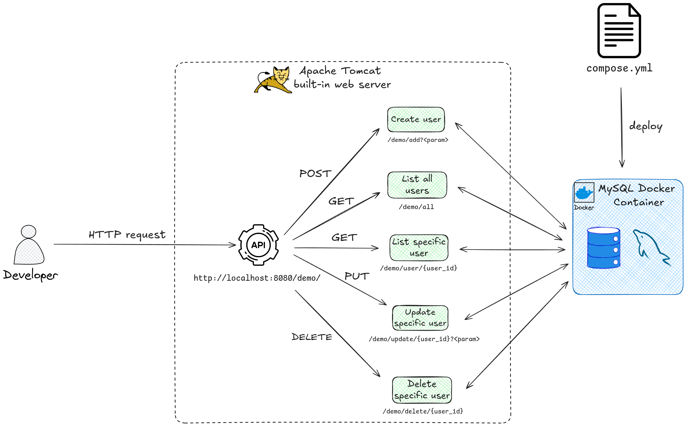

# Demo Java Spring Boot App with CRUD Operations and MySQL Database Access

This is a demo application developed with [Java Spring Boot framework](https://spring.io/projects/spring-boot) that provides a **CRUD-based API** that allows you to **Create, Read, Update,** and **Delete** user records within a **MySQL database**. It exposes specific **REST endpoints** - like `/add`, `/all`, and `/delete` - which act as the entry points for managing user data via standard HTTP methods. By leveraging **Spring Data JPA**, the app automatically maps your Java objects to database rows, eliminating the need to write manual SQL for these operations.



**The main app files in `/src/main/..`**:  
- `MainController.java`: Handles the incoming network requests (URLs) and converts the response back into a format the user can see (JSON).
- `UserRepository.java`: An interface that acts as the bridge; you don't write the code here, but Spring uses it to generate the SQL needed for the database.
- `User.java`: The Entity or "Blueprint" that defines what a user looks like in both Java and the MySQL table.

## What is Spring Boot?

Spring Boot is like a **"pre-assembled" toolkit** for Java developers that handles all the boring setup work automatically so you can start coding your ideas immediately. Instead of manually configuring complex server settings and database connections, the framework uses **auto-configuration** to "guess" what your app needs based on the libraries you've added. It also includes a **built-in web server**, meaning your application can run anywhere as a single, independent file without needing extra software installed. Essentially, it transforms the heavy, traditional process of building Java applications into a streamlined experience that is fast, reliable, and ready for the real world.

For more information, see [Spring Boot Overview](https://spring.io/projects/spring-boot#overview).

## Docker Compose Support in Spring Boot 3.1

[Spring Boot 3.1](https://spring.io/blog/2023/06/21/docker-compose-support-in-spring-boot-3-1) introduced Docker Compose support, which automatically manages your service containers (like MySQL or Redis) the moment you run your Java application. Instead of manually running docker compose up, **Spring Boot detects your `compose.yaml` file, starts the required services, and automatically configures the connection details (like URLs and passwords) for you**. This creates a "no-config" development experience where the application and its dependencies spin up and shut down as a single, synchronized unit.

## Prerequisites

To run the app, ensure that you have met the following requirements:
- Installed [Java 17](https://www.oracle.com/java/technologies/downloads/) or later
```bash
java -version
```
- [Java Development Kit (JDK) 8+](https://docs.oracle.com/en/java/javase/index.html)
```bash
javac -version
```
- [Maven build tool](https://maven.apache.org/install.html)
```bash
maven -v
```
- [Docker](https://docs.docker.com/engine/install/) or [Docker Desktop](https://docs.docker.com/desktop/)
```bash
docker -v
```
- [Docker Compose plugin](https://docs.docker.com/compose/install/) (Linux only)
```bash
docker-compose -v
```
- (OPTIONAL) [`ctop`](https://ctop.sh/) CLI tool to view Docker containers

## Running the App

To run the app:
```bash
./mvnw spring-boot:run
```
This will launch local web server listening on port `8080`.

To test the app's API endpoint use the following commands:

1. **Create a User (POST)**  
This command adds a new entry to your MySQL database.  
Command: `curl -X POST "http://localhost:8080/demo/add?name=John&email=john@example.com"`

2. **View All Users (GET)**  
This retrieves the full list of users in JSON format.  
Command: `curl -X GET http://localhost:8080/demo/all`

3. **Get One Specific User (GET)**  
This fetches a single user based on the ID in the URL path.  
Command: `curl -X GET http://localhost:8080/demo/user/1`

4. **Update a User (PUT)**  
This command modifies the name and email of the user with ID 1.  
Command: `curl -X PUT "http://localhost:8080/demo/update/1?name=JohnDoe&email=newemail@example.com"`

5. **Delete a User (DELETE)**  
This removes the user with ID 1 from your database.  
Command: `curl -X DELETE http://localhost:8080/demo/delete/1`

## Project Structure

```
demo-java-springboot-app/
├── src/
│   ├── main/
│   │   ├── java/com/example/accessingdatamysql/
│   │   │   ├── AccessingDataMysqlApplication.java
│   │   │   ├── MainController.java
│   │   │   ├── User.java
│   │   │   └── UserRepository.java
│   │   └── resources/
│   │       ├── application.properties
│   │       ├── static/
│   │       └── templates/
│   └── test/
├── target/
├── .mvn/wrapper/
├── pom.xml
├── compose.yaml
├── mvnw
└── mvnw.cmd
```

### Core Files and Directories

**`src/main/java/`** - Contains all Java source code for the application
- **`AccessingDataMysqlApplication.java`** - Main entry point that bootstraps the Spring Boot application
- **`MainController.java`** - REST API controller handling HTTP requests (GET, POST, PUT, DELETE)
- **`User.java`** - Entity model representing the database table structure
- **`UserRepository.java`** - Data access interface for database operations using Spring Data JPA

**`src/main/resources/`** - Configuration and static resources
- **`application.properties`** - Application configuration (database settings, JPA behavior)
- **`static/`** - Static web assets (CSS, JavaScript, images)
- **`templates/`** - Server-side templates (Thymeleaf, if used)

**`src/test/`** - Unit and integration tests

**`target/`** - Compiled bytecode and build artifacts (generated by Maven, not committed to Git)

**`pom.xml`** - Maven project configuration defining dependencies, plugins, and build settings

**`compose.yaml`** - Docker Compose configuration for MySQL database container

**`mvnw` / `mvnw.cmd`** - Maven wrapper scripts allowing Maven execution without local installation

**`.mvn/wrapper/`** - Maven wrapper configuration files

## Basic Docker Compose Commands

| Command | Lifecycle Phase | Description | Key Flag/Usage |
| --- | --- | --- | --- |
| **`docker compose up`** | **Start** | Creates and starts all containers defined in the YAML file. | `-d` (Detached mode) to run in the background. |
| **`docker compose up --build`** | **Rebuild & Start** | Forces a rebuild of the Dockerfile before starting. | Use this after changing Java code or Maven/Gradle dependencies. |
| **`docker compose down`** | **Teardown** | Stops and **removes** containers, networks, and images. | `-v` to also remove persistent volumes (data). |
| **`docker compose stop`** | **Pause** | Stops the containers but does **not** remove them. | Use this if you want to resume exactly where you left off. |
| **`docker compose start`** | **Resume** | Starts existing containers that were previously stopped. | Useful for a quick restart without recreating resources. |
| **`docker compose ps`** | **Status** | Lists the status of all services in the current stack. | Shows which containers are `running`, `exited`, or `unhealthy`. |
| **`docker compose logs`** | **Monitor** | Displays the output (STDOUT/STDERR) of your services. | `-f` (Follow) to stream live Spring Boot startup logs. |
| **`docker compose exec`** | **Interact** | Runs a command inside a specific running container. | `docker compose exec db` to enter the database container. |

## References
- [Spring Boot Quick Start Guide](https://spring.io/quickstart)
- [Spring Boot Guides](https://spring.io/guides)
- [Spring Boot Project Initializer Tool: start.spring.io](https://start.spring.io/)